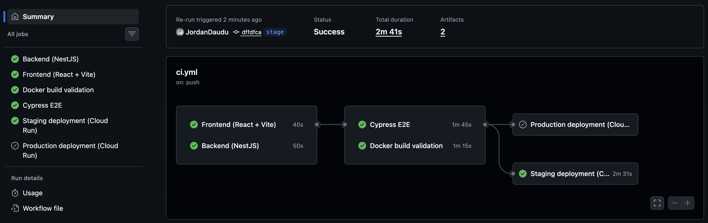

# CI / CD

Pipeline: `.github/workflows/ci.yml`.

The workflow runs on:

- Pushes to `feature/**`, `dev`, `stage`, and `main`
- Pull requests targeting `dev`, `stage`, or `main`

## Jobs

| Job | When | What it does |
|---|---|---|
| `backend` | every push / PR | Installs backend dependencies, generates Prisma client, applies schema, runs unit tests, runs integration tests, and builds the NestJS app |
| `frontend` | every push / PR | Installs frontend dependencies, runs Vitest component/API tests, and builds the Vite app |
| `docker-build` | PRs into dev/stage/main + pushes to dev/stage/main | Validates Docker Compose files and builds backend/frontend Docker images |
| `cypress-e2e` | PRs into dev/stage/main + pushes to dev/stage/main | Starts the full Docker Compose stack, waits for backend `/health`, runs Cypress, and tears down containers |
| `staging-deployment` | push to `stage` | Builds and pushes Docker images, deploys staging backend/frontend services to Google Cloud Run, and verifies backend `/health` |
| `production-deployment` | push to `main` | Builds and pushes Docker images, deploys production backend/frontend services to Google Cloud Run, and verifies backend `/health` |

## Postgres in CI

The `backend` job uses a `postgres:16-alpine` service container.

The backend test job runs:

- Prisma client generation
- Schema push into the CI PostgreSQL database
- Unit tests for calculation and service logic
- Integration tests for REST endpoints, including `/health`

## Required GitHub Actions secrets

The Cloud Run deployment jobs require these repository secrets.

| Secret | Used by | Purpose |
|---|---|---|
| `GCP_PROJECT_ID` | staging + production deployment | Google Cloud project ID |
| `GCP_REGION` | staging + production deployment | Google Cloud region, for example `europe-west1` |
| `GCP_ARTIFACT_REPOSITORY` | staging + production deployment | Artifact Registry Docker repository name |
| `GCP_WORKLOAD_IDENTITY_PROVIDER` | staging + production deployment | Workload Identity provider for GitHub Actions authentication |
| `GCP_SERVICE_ACCOUNT` | staging + production deployment | Google Cloud service account used by GitHub Actions |
| `CLOUD_RUN_SERVICE_ACCOUNT` | staging + production deployment | Runtime service account assigned to Cloud Run services |
| `STAGING_BACKEND_SERVICE` | staging deployment | Staging backend Cloud Run service name |
| `STAGING_FRONTEND_SERVICE` | staging deployment | Staging frontend Cloud Run service name |
| `STAGING_DATABASE_URL` | staging deployment | Staging PostgreSQL connection string |
| `PRODUCTION_BACKEND_SERVICE` | production deployment | Production backend Cloud Run service name |
| `PRODUCTION_FRONTEND_SERVICE` | production deployment | Production frontend Cloud Run service name |
| `PRODUCTION_DATABASE_URL` | production deployment | Production PostgreSQL connection string |

Database credentials are not committed to the repository. The deployment script stores `DATABASE_URL` in Google Secret Manager and injects it into Cloud Run.

## Deployment flow

### Staging

A push or merge into `stage` triggers:

1. Backend tests
2. Frontend tests
3. Docker build validation
4. Cypress E2E test
5. Cloud Run staging deployment
6. Backend `/health` verification

Deployment script:

    scripts/deploy-staging.sh

### Production

A push or merge into `main` triggers the production deployment flow.

Deployment script:

    scripts/deploy-production.sh

Production deployment is treated as extra credit for the assignment.

## Stage names shown in GitHub Actions

The workflow contains clearly named stages:

- Backend install
- Backend unit tests
- Backend integration tests
- Backend build
- Frontend install
- Frontend component tests
- Frontend build
- Docker build validation
- Cypress E2E
- Staging deployment
- Production deployment

## CI/CD Evidence

A successful GitHub Actions run should be captured before final submission and added here.

Successful CI/CD run:

